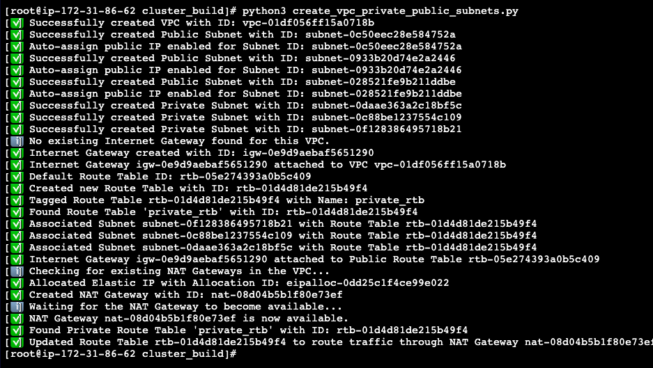

## Why we need IRSA:

Kubernetes relies on several tools, including aws-vpc-cni, ebs-csi-driver, efs-csi-driver, and aws-load-balancer-controller, to handle AWS infrastructure tasks for you, enabling essential services within your clusters. As an illustration, the VPC CNI connects to AWS to manage network resources for Pods and therefore needs AWS account permissions. Likewise, the EBS CSI Driver creates storage volumes in AWS on your behalf, which also requires access to your AWS account.

## Options before IRSA:
1. **Storing AWS access and secret keys directly in Kubernetes Secrets:** This was easy but very insecure due to potential credential exposure and difficult rotation

2. **Assigning IAM policies to the worker nodes IAM roles:** This was more secure than storing keys but lacked granularity, meaning all Pods on a node got the same permissions, often leading to over-permissioning.

## How IRSA works:
1. IRSA makes use of OpenID Connect (OIDC) federation between your EKS cluster and AWS IAM, During this process EKS cluster acts as OIDC provider. 
2. create an IAM Role with a trust policy that trusts the EKS OIDC provider and specifies conditions based on Kubernetes Service Account names and namespaces.
3. Annotate Kubernetes Service Accounts with the ARN of the IAM Role.
4. Pods using these annotated Service Accounts automatically get temporary AWS credentials via the AWS SDK

## How pod gets AWS permissions using IRSA:
1. Lets say an application within a Pod needs to interact with AWS services. AWS SDK initiates the credential acquisition process.
2. SDK securely obtains a unique identity token (JWT) for the Pod's Service Account from the local Kubernetes component (kubelet). This token is signed by your EKS cluster's identity provider
3. The SDK sends this identity token, along with the ARN of the desired IAM Role, to AWS's security service (STS)
4. AWS STS verifies the authenticity of the identity token with your EKS cluster's identity provider. It then checks if the IAM Role's configuration trusts this specific Service Account (based on its namespace and name)
5. If the token is valid and the trust is established, STS issues short-lived AWS credentials (access key, secret key, session token) to the Pod.
6. Then application in the Pod uses these temporary credentials to securely access the AWS resources permitted by the assumed IAM Role.

## Implementation

#### 1. Connect to AWS Account
- Log in to your AWS account using the root user.
- Create a new IAM user with the `AdministratorAccess` policy.

#### 2. Spin up the lab environment in aws account using python script, which spins up the VPC components as per below:


```bash
git clone https://github.com/IndrasenaKallam/devops_labs.git
cd devops_labs/kubernetes/EKS/cluster_build
sh pre-req.sh
python3 create_vpc_private_public_subnets.py

```



#### 3. Spin up the cluster, current script used public subnets for provisioning

```bash
cd kubernetes/EKS/cluster_build
python3 public_eks.py
```
   

#### 4. Update the kubeconfig in the bastion instance
```bash
aws eks update-kubeconfig --region us-east-1 --name ikallam-public-cluster
```
#### 5. Implementation of IRSA:
- Create a IRSA (IAM role for service account) and attach required policies
- Creation of service account in required namespace and annotate the service account with IRSA arn
- Deploy the pod in required namespace which uses service account
- Testing the pod whether it can get access to required aws service

1. **Register EKS cluster OIDC provider with IAM service**

    Get provider certificate thumbprint:
    
    ```bash
    OIDC_DOMAIN=$(aws eks describe-cluster --name ikallam-public-cluster \
    --query "cluster.identity.oidc.issuer" --output text | \
    sed 's/^https:\/\///' | cut -d'/' -f1)

    THUMBPRINT=$(openssl s_client -connect ${OIDC_DOMAIN}:443 -servername ${OIDC_DOMAIN} </dev/null 2>/dev/null \
    | openssl x509 -fingerprint -noout -sha1 \
    | awk -F= '{gsub(":", "", $2); print tolower($2)}')
    ```

    Create an identity provider in IAM service:

    ```bash
    OIDC_URL=$(aws eks describe-cluster \
    --name ikallam-public-cluster \
    --query "cluster.identity.oidc.issuer" \
    --output text)

    # Register EKS cluster with identity provider 
    aws iam create-open-id-connect-provider \
    --url $OIDC_URL \
    --thumbprint-list $THUMBPRINT \
    --client-id-list sts.amazonaws.com \
    --tags Key=owner,Value=ikallam
    ```


2. **Fetch dynamic values of required variables:**
    ```bash
    export AWS_REGION="us-east-1"

    account_id=$(aws sts get-caller-identity --query "Account" --output text)

    oidc_provider=$(aws eks describe-cluster --name ikallam-public-cluster --region $AWS_REGION --query "cluster.identity.oidc.issuer" --output text | sed -e "s/^https:\/\///")

    export namespace=irsa-namespace

    export service_account=irsa-test-serviceaccount
    ```  

3. **Create an IAM role for the service account:**
Create a `irsa-trust-policy.json` file using the account ID and OIDC provider URL.

    ```json
    cat >irsa-trust-policy.json <<EOF
    {
    "Version": "2012-10-17",
    "Statement": [
        {
        "Effect": "Allow",
        "Principal": {
            "Federated": "arn:aws:iam::$account_id:oidc-provider/$oidc_provider"
        },
        "Action": "sts:AssumeRoleWithWebIdentity",
        "Condition": {
            "StringEquals": {
            "$oidc_provider:aud": "sts.amazonaws.com",
            "$oidc_provider:sub": "system:serviceaccount:$namespace:$service_account"
            }
        }
        }
    ]
    }
    EOF
    ```

4. **Create a IRSA for service using above trust policy json file:**

    ```bash
    aws iam create-role --role-name ikallam-irsa-testing-role \
    --assume-role-policy-document file://irsa-trust-policy.json \
    --tags Key=owner,Value=ikallam Key=cluster,Value=ikallam-public-cluster
    ``` 

5. **Attach required policy:**
    ```bash
    aws iam attach-role-policy \
    --role-name ikallam-irsa-testing-role  \
    --policy-arn arn:aws:iam::aws:policy/AmazonEC2FullAccess
    ```


#### Validations:

1. **Create a namespace and service account with annotations:**
    ```bash
        # Create a namespace
        k create ns irsa-namespace

        # Create a service account
        k create sa irsa-test-serviceaccount -n irsa-namespace

        # Annotate the service account with the role created above
        k annotate serviceaccount irsa-test-serviceaccount \
        eks.amazonaws.com/role-arn=arn:aws:iam::471112902367:role/ikallam-irsa-testing-role \
        -n irsa-namespace
    ```

2. **Creating a testing pod to test EC2 access**
    ```bash
    cat <<EOF | kubectl apply -f -
    apiVersion: v1
    kind: Pod
    metadata:
      name: ec2-describe-test
      namespace: irsa-namespace
    spec:
      serviceAccountName: irsa-test-serviceaccount
      containers:
        - name: aws-cli
          image: amazon/aws-cli:latest
          command: ["/bin/sh", "-c"]
          args: ["sleep 4800"]
    EOF
    ```

3. **Validate EC2 access:**
    ```bash
    aws ec2 describe-instances   --query "Reservations[*].Instances[*].InstanceId"   --output text

    i-00cd5f28c620b48ea
    i-07ae4f8372d074e72
    i-0739d709d811ef1f6
    ```