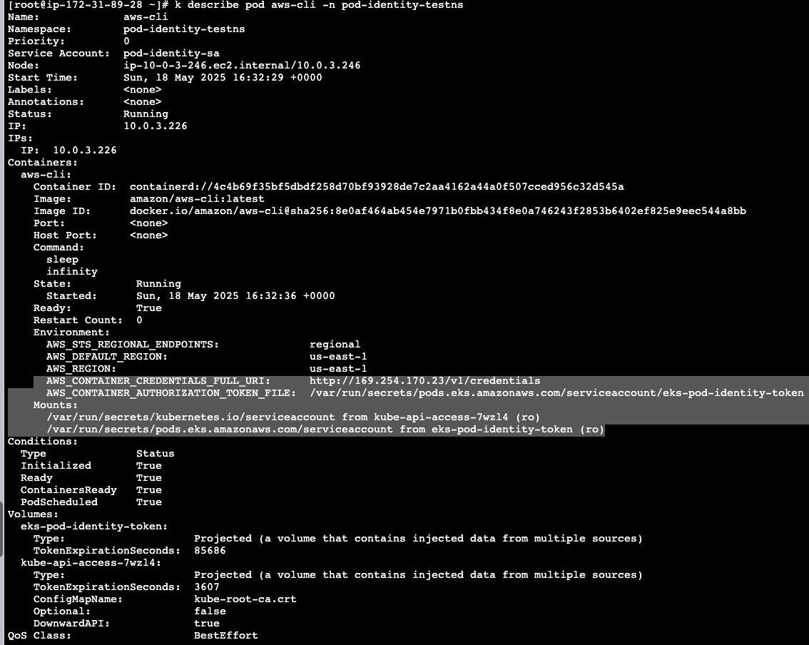

```
# create an addon

aws eks create-addon \
  --cluster-name ikallam-public-cluster \
  --addon-name eks-pod-identity-agent \
  --addon-version v1.1.0-eksbuild.1 \
  --configuration-values file://tolerate-all-taints.json \
  --tags owner=ikallam

```

```
[root@ip-172-31-89-28 ~]# k get ds eks-pod-identity-agent -n kube-system
NAME                     DESIRED   CURRENT   READY   UP-TO-DATE   AVAILABLE   NODE SELECTOR   AGE
eks-pod-identity-agent   4         4         4       4            4           <none>          4m58s
```

```bash
aws iam create-role \
  --role-name ikallam-pod-identity-test-role \
  --assume-role-policy-document file://pod-identity-trust-policy.json \
  --tags Key=owner,Value=ikallam Key=cluster,Value=ikallam-public-cluster
```

```bash
aws iam attach-role-policy \
  --role-name ikallam-pod-identity-test-role \
  --policy-arn arn:aws:iam::aws:policy/AmazonEC2ReadOnlyAccess
```

Create pod Identity association

k create ns pod-identity-testns
k create sa pod-identity-sa -n pod-identity-testns

```
[root@ip-172-31-89-28 ~]# k get sa -n pod-identity-testns
NAME              SECRETS   AGE
default           0         12m
pod-identity-sa   0         9s
```
export account_number=$(aws sts get-caller-identity --query "Account" --output text)
aws eks create-pod-identity-association \
--cluster-name ikallam-public-cluster \
--namespace pod-identity-testns \
--service-account pod-identity-sa \
--role-arn arn:aws:iam::${account_number}:role/ikallam-pod-identity-test-role

allocation-id=a-mbt5sahfesjyrrtrl


aws eks list-pod-identity-associations \
  --cluster-name ikallam-public-cluster \
  --namespace pod-identity-testns \
  --service-account pod-identity-sa

aws eks describe-pod-identity-association \
--cluster-name ikallam-public-cluster \
--association-id a-mbt5sahfesjyrrtrl

aws eks update-pod-identity-association \
  --cluster-name ikallam-public-cluster \
  --association-id a-mbt5sahfesjyrrtrl \
  --role-arn arn:aws:iam::471112902367:role/ikallam-pod-identity-test-role


```
aws eks update-pod-identity-association \
  --cluster-name ikallam-public-cluster \
  --association-id a-mbt5sahfesjyrrtrl \
  --role-arn arn:aws:iam::${account_number}:role/ikallam-pod-identity-test-role
{
    "association": {
        "clusterName": "ikallam-public-cluster",
        "namespace": "pod-identity-testns",
        "serviceAccount": "pod-identity-sa",
        "roleArn": "arn:aws:iam::471112902367:role/ikallam-pod-identity-test-role",
        "associationArn": "arn:aws:eks:us-east-1:471112902367:podidentityassociation/ikallam-public-cluster/a-aucdjy2aknga0ngux",
        "associationId": "a-aucdjy2aknga0ngux",
        "tags": {},
        "createdAt": "2025-05-18T16:27:09.806000+00:00",
        "modifiedAt": "2025-05-18T16:27:09.806000+00:00"
    }
}
```


```
aws eks list-pod-identity-associations \
  --cluster-name ikallam-public-cluster \
  --namespace pod-identity-testns \
  --service-account pod-identity-sa
```


cat <<EOF | kubectl apply -f -
apiVersion: v1
kind: Pod
metadata:
  name: pod-identity-testing-pod
  namespace: pod-identity-testns
spec:
  serviceAccount: pod-identity-sa
  containers:
    - name: aws-cli
      image: amazon/aws-cli:latest
      command: ["sleep", "infinity"]
EOF

k exec -it pod-identity-testing-pod -n pod-identity-testns -- bash
kubectl exec -it pod-identity-testing-pod -n pod-identity-testns -- aws ec2 describe-instances

bash-4.2# aws ec2 describe-instances   --query "Reservations[*].Instances[*].InstanceId"   --output text
i-0fc5c65e5e3ff5f5a
i-0d1c58b9eaee41b14
i-0c20c4f4ba2d3b158
i-0bb1950c1251425cf
i-0e002ba01cf0b59eb


aws eks list-pod-identity-associations   --cluster-name ikallam-public-cluster



AWS_CONTAINER_CREDENTIALS_FULL_URI:      http://169.254.170.23/v1/credentials
AWS_CONTAINER_AUTHORIZATION_TOKEN_FILE:  /var/run/secrets/pods.eks.amazonaws.com/serviceaccount/eks-pod-identity-token

Mounts:
  /var/run/secrets/kubernetes.io/serviceaccount from kube-api-access-7wzl4 (ro)
  /var/run/secrets/pods.eks.amazonaws.com/serviceaccount from eks-pod-identity-token (ro)


